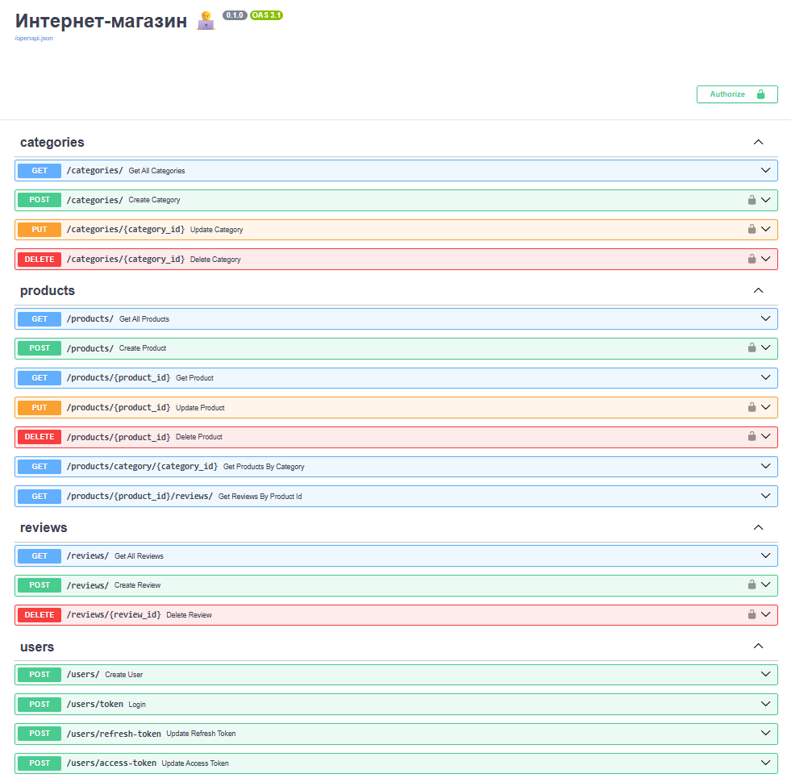

## O проекте

Комплексный учебный проект по разработке веб-приложения на FastAPI. Проект охватывает полный цикл создания бэкенда: от теоретических основ REST API до разработки базового функционала небольшого интернет магазина и его деплоя.

Содержание проекта:
- **Основы API** — архитектура REST, HTTP-методы, коды ответов
- **FastAPI** — маршрутизация, валидация параметров, Pydantic-модели
- **CRUD-приложение** — обработка запросов, шаблоны Jinja, обработка ошибок
- **Dependency Injection** — управление зависимостями через `Depends()`
- **Интернет-магазин** — SQLAlchemy, Alembic, аутентификация (OAuth2, JWT)
- **Продвинутые возможности** — версионирование API, Celery + Redis, WebSocket
- **Docker** — контейнеризация и деплой с PostgreSQL, Gunicorn, Nginx

<hr>


### Настройка окружения

Установим необходимые пакеты на Ubuntu:
```sh
sudo apt -q update
sudo apt -q -y install build-essential cmake wget zip unzip

gcc --version
cmake -version
```

Формирование `__pycache__` файлов в директории `~/.cache` а не в дириктории проекта:
```
echo 'export PYTHONPYCACHEPREFIX="${HOME}/.cache/pycache"' >> "${HOME}/.bashrc"
```

Установим `docker` по инстркуциями из [официальной документации](https://docs.docker.com/engine/install/ubuntu/):
```sh
for pkg in docker.io docker-doc docker-compose docker-compose-v2 podman-docker containerd runc; do sudo apt-get remove $pkg; done
```

```sh
sudo apt-get update
sudo apt-get install ca-certificates curl
sudo install -m 0755 -d /etc/apt/keyrings
sudo curl -fsSL https://download.docker.com/linux/ubuntu/gpg -o /etc/apt/keyrings/docker.asc
sudo chmod a+r /etc/apt/keyrings/docker.asc

echo \
  "deb [arch=$(dpkg --print-architecture) signed-by=/etc/apt/keyrings/docker.asc] https://download.docker.com/linux/ubuntu \
  $(. /etc/os-release && echo "${UBUNTU_CODENAME:-$VERSION_CODENAME}") stable" | \
  sudo tee /etc/apt/sources.list.d/docker.list > /dev/null
sudo apt-get update
```

```sh
sudo apt-get install docker-ce docker-ce-cli containerd.io docker-buildx-plugin docker-compose-plugin
```

Проверим, что `docker` установлен с помощью команды:
```sh
sudo docker -v
```

Добавим команду запуска `docker` не из-под суперпользователя
```sh
sudo usermod -aG docker $USER
```

<hr>


### Инициализация и запуск проекта

Устанавливаем пакетный менеджер [uv](https://docs.astral.sh/uv/getting-started/installation/):
```sh
curl -LsSf https://astral.sh/uv/install.sh | sh
```

Чтобы изменения внесённые в файл `bashrc` в текущем сеансе терминала вступили в силу, файл необходимо перезагрузить:
```sh
source ~/.bashrc
```

Копируем репозиторий:
```sh
git clone https://github.com/dmt-zh/fastapi-ecommerce-shop.git && cd fastapi-ecommerce-shop
```

Создаем виртуальное окружение и устанавливаем зависимости:
```sh
uv sync --locked
```

Для установки дополнительных зависимостей проверки кода (линтеров):
```sh
uv sync --group lint
```

Создаем `.env` файл на основании файла `.env.example`:
```sh
cp .env.example .env
```

Редактируем переменные в файле `.env`

В `Makefile` содержаться команды управления инфраструктурой и проверки кода с помощью линтера `ruff`. Получить справку можно с помощью следующей команды:
```sh
make help
```

В результате будет получен следующий вывод:
```
› help:                       Отображение сообщения с доступными командами
› init-migrations:            Инициализация среды миграций
› start:                      Запуск приложения
› stop:                       Остановка приложения
› create-tables-migration:    Создание таблиц базы данных
› apply-migrations:           Применение миграции
› app-run:                    Запуск приложения
› dev-app-run:                Запуск приложения во время разработки
› lint-check:                 Проверка кода на наличие ошибок без внесения изменений
› lint-fix:                   Исправление ошибок в коде с помощью ruff
› type-check:                 Cтатическая проверка типов в Pytho
```

Запускаем приложение:
```sh
make start
```

Cоздадим новую среду миграций, для взаимодействия с SQLAlchemy
```sh
make init-migrations
```

В результате:
- сформируется файл `alembic.ini` в корне проекта;
- сформируется директория `src/migrations` с файлами `env.py`, `script.py.mako` и папкой `versions` для хранения миграций.


Далее необходимо выполнить изменения в файле `./src/migrations/env.py`:
- импортировать `Base` и `PostgreSQLDatabase` из `src.services.database.postgresq`, а также модели из `src`:
```python
from src import models
from src.services.database.postgresql import Base, PostgreSQLDatabase
from src.config import get_settings
DATABASE_URL = PostgreSQLDatabase(settings=get_settings()).database_url
```
- установить значение `target_metadata` равное `Base.metadata`:
```python
target_metadata = Base.metadata
```

- изменить инициализацию конфига в функции `run_async_migrations`:
```python
async def run_async_migrations() -> None:
    """In this scenario we need to create an Engine
    and associate a connection with the context.

    """
    ini_config = config.get_section(config.config_ini_section, {})
    ini_config['sqlalchemy.url'] = DATABASE_URL
    connectable = async_engine_from_config(
        ini_config,
        prefix="sqlalchemy.",
        poolclass=pool.NullPool,
    )

    async with connectable.connect() as connection:
        await connection.run_sync(do_run_migrations)

    await connectable.dispose()
```

Cоздаем начальную миграцию (создание таблиц в базе данных):
```sh
make create-tables-migration
```
В результате команда сгенерирует файл в `./src/migrations/versions/`, описывающий создание таблиц.

Применяем миграцию для создания таблиц:
```sh
make apply-migrations
```

При успешном выполнении команд, в базе данных создадутся таблицы. Проверить это можно следующим образом:
- зайти в `psql` в докере с помощью команды: `docker exec -it  <containerName> psql -U <dataBaseUserName> <dataBaseName>`
- c помощью команды `\dt` посмотреть созданные таблицы:
```
            List of relations
 Schema |      Name       | Type  |
--------+-----------------+-------+
 public | alembic_version | table | 
 public | categories      | table | 
 public | products        | table | 
(3 rows)

```
- выйти из `psql` с помощью команды `\q`


<hr>


### Запуск проекта в режиме разработки

Запускаем FasAPI приложение с помощью команды:
```sh
make run-app-dev
```

По адресу **[http://127.0.0.1:8000/docs/](http://127.0.0.1:8000/docs/)** в веб браузере будет доступна документация API


